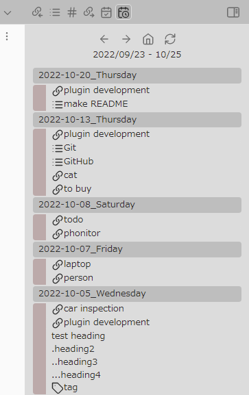
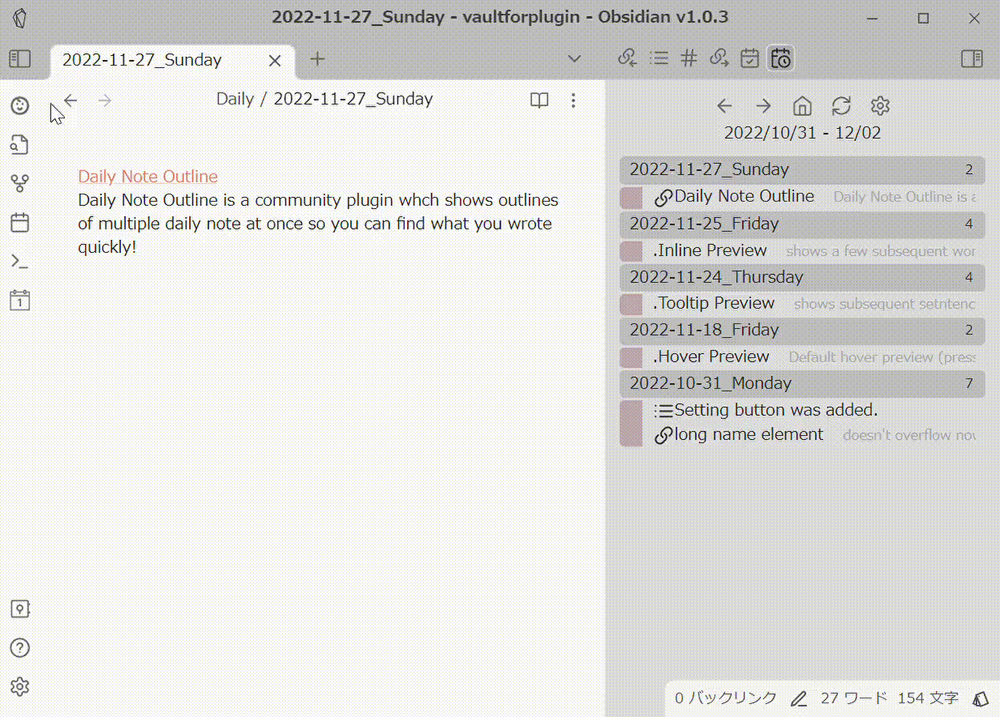
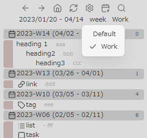

# Obsidian Daily Note Outline
ページ後半に日本語のドキュメントがあります。
Japanese documentation is located on the second half of this page.

## Introduction
Daily notes are a good place to write down various little notes and thoughts. However, sometimes it can be difficult to find which daily note you wrote them in later. 
This plugin creates a custom view that displays the outlines of multiple daily notes at once. The outline can display not only headings, but also links, tags and list items.

## New experimental function for v1.4.0 - Show backlink files

Daily Note Outline v1.4.0 adds displaying backlink files.(Settings -> Basics -> Show backlink files) 
In my use case, I have created a template file like `[[{{date}}]]` and assigned a hotkey with the Hotkeys for templates plugin by @Vinzent03 (https://github.com/Vinzent03/obsidian-hotkeys-for-templates) to insert a link to the daily note for that day. 
Users who create daily notes every day will find this convenient, as they can see the note with the date inserted from DNO view.

**Notes**
From a speed perspective, I strongly recommend installing Dataview plugin when turning this feature on. 
The Dataview plugin caches the vault's backlink information, and DNO attempts to use its cache when Dataview plugin is activated. In this case, the backlink information can be retrieved significantly faster than without Dataview.

### Usage
- After activating the feature, the current granularity (day/week/month/quarter/year) and calendar set name will be displayed on DNO's view.
- Left-clicking on them will toggle the granularity or calendar set to display in sequence. Right-clicking on them will show a list and allow you to select one.

## Getting started
Install the plugin from the community plugin list. 
Make sure either Daily Note core plugin or Periodic Notes plugin is enabled. 
To display the outline, choose "Daily Note Outline: Open Outline" in the command pallete. 

## How to use
To change the date range to display, click on the left and right arrows. 
To return to the initial date range, click on the house icon. 
Click on the refresh icon to redraw the outline. 
Click on the gear icon to open setting (Right-clicking opens a context menu where you can quickly change several settings).
Click on the calendar with plus icon to create/open today's daily note (you can create/open tomorrow's daily note by right-clicking).
Click on each outline element to open its location. 
Push Ctrl key to preview. 
I recommend that you first set the display/hide settings for each outline element (headings, links, tags, and list items) in the settings.

## Feature
### Support for Periodic Notes plugin

Daily Note Outline v1.0.0- supports for periodic notes. That is, support for weekly/monthly/quarterly/yearly notes and calendar sets.
(For more information on periodic notes, see https://github.com/liamcain/obsidian-periodic-notes) 
To display periodic notes in DNO, the following steps are required.
- Install and activate Periodic Notes community plugin and properly configure the granularity and folder paths to be used.
- Activate "periodic notes" and "calendar sets" in the "Periodic Notes" section of the DNO settings.

**Notes**
- Calendar sets is a feature added in Periodic Notes v1.0.0-beta version and is not available in v0.0.17.  To use the calendar set feature, you must install the beta version of Periodic Notes, e.g., by using Obsidian BRAT plugin.
	- Also, since calendar sets is a beta feature of Periodic Notes, there is a possibility that it may not be available in DNO in the future due to specification changes in Periodic Notes.
- If you find any problems, please let me know at the forum or GitHub repository.

### Simple filter / Include / Exclude

In order to hide unnecessary items and display only the necessary ones, three types of filter functions are implemented: **Simple filter**, **Include**, and **Exclude**.

**Simple filter** simply hides items that match a specified word or phrase. The hierarchy of items is not taken into account. 
**Include** can be applied to only one type of outline element. It treats the range from the outline element of the specified type to the next similar element as a block, and only items matching the specified word or phrase and belonging to that block are displayed. 
Conversely, **Exclude** hides matching items and their blocks. If you specify an element type in the "excluding ends at" section of the settings, or if Include is enabled, the block is considered to have ended at that element, and only that part of the block is hidden.

**Include** and **Exclude** can be used at the same time. (However, it does not make sense to specify the exclude keyword for an element type that is specified in Include.)
**Simple filter** can be used in conjunction with other filters. For example, if you specify the same keywords as those specified for Include, you can display only the elements that belong to the elements matched the include keywords, not the elements themselves.

### Extract
You can extract only outline elements that contain a specific words. There are three ways to do this. 

1. Click on the magnifying glass button and type in the string you want to extract. 
2. Right-click on the outline element and select 'extract' from the context menu. Only elements containing the same name will be extracted. 
3. Right-click on the magnifying glass button and choose 'extract tasks'. Only list items that have checkbox will be extracted. 
Items that have been hidden by filtering or other means will not be displayed. 
To cancel the extraction, click the X button (the magnifying glass button will change to an X button). 

## Settings
Some child items are not initially displayed and will appear when the parent item is turned on.

### Basics
#### Initial search type
- backward(default)
	- Displays the past daily notes for the specified number of days starting from today.   
- forward
	- Displays daily notes for the specified number of days starting from the date specified in Onset date.  

#### Include future daily notes
When backward search is used, daily notes of the specified number of days in the future are also displayed (If you set it long enough, you can also use this plugin as a list of upcoming events!).

#### Onset date
For forward search, specify the date in YYYY-MM-DD format to start the search at startup. 
Clicking on the date range under UI buttons jumps to the date.

#### Search duration
Specify the number of days to be explored per page. It is recommended to set a shorter period for those who use Daily notes every day and a longer period for those who use it only occasionally. I would recommend about 7-56 days.

#### Show headings / links / tags / list items & tasks 
Choose whether each element should be displayed in outline.

#### Show all root list items
With respect to list item, if this setting is off, it shows only the first item in a continuous list. When turned on, it displays all list items at root level.

#### Show all tasks / Tasks only / Hide completed tasks
Display setting for tasks (list items including checkboxes).
Show all tasks will show all levels of tasks, regardless of the list settings above; Task only will hide all list items except for tasks; Hide completed tasks will hide completed tasks.

#### Display file information
Display file information to the right of each daily note file name. 
lines: number of lines in the file 
distance: how far away the period is from the base date (today for backward search, the date specified in Onset date for forward search)

#### Position of the plugin view
Specify where to display the plugin's view when redisplaying or updating.
(You can specify other than the left and right sidebars, but the behavior may not be as sophisticated.)

### Periodic Notes
This section will not appear unless the Periodic Notes community plugin is activated.

#### calendar sets
Turn on if you want to use the calendar set in the Periodic Notes plugin. (Periodic Notes beta version must be installed)

#### periodic notes
Turn on if you want to use periodic notes.

#### Search duration for periodic notes
Specify the search duration per page for each periodic note.

#### attach date range to weekly notes
Displays the corresponding date range next to the file name of the weekly note.

### Headings
#### Heading level to display
Choose whether each level of headings should be displayed in outline.

### Preview
#### Inline Preview
Show a few subsequent words next to each outline elements.

#### Tooltip Preview
Show subsequent sentences as a tooltip with mouse hover.

#### Tooltip Preview direction
Specify the direction to display the tooltip preview. 
(I couldn't find the way to automatically determine appropriate direction...)

### Simple filter
#### Headings/Links/Tags/List items to ignore
If each outline element contains a specified word or phrase, that outline element will not be displayed. 
Specify one per line.

### Include
#### Element type for include
Specifies the type of outline element to apply the Include filter to.

#### Words to include
Only outline elements containing the specified word or phrase and the block following it will be displayed.
Each should be separated by a new line.

#### Include the beginning part
Specifies whether the beginning part of a note that precedes the appearance of the outline element specified in Element type for include is to be displayed.

### Exclude
#### Exclusion end at
If any of the outline element types is specified in this field, the area excluded by Exclude filter is terminated at the specified element.
If any type is specified in Include filter, Exclude is terminated at that type and this field is ignored.

#### Headings/ Links/ Tags/ List items to exclude
The outline element containing the specified word or phrase and the area following it will be hidden.
Each should be separated by a new line.

### Appearance
Sets the appearance of each outline element when it is displayed.
An icon and prefix string can be added to each element.
If you choose 'custom' for icon, enter icon name of the Lucide icon (https://lucide.dev/ ) in 'Custom icon' field. Some icons do not seem to be able to be displayed.

#### Indent other than headings
When you choose 'follow preceding headings', other elements are indented according to the preceding heading level.

#### Headings: Repeat heading prefix
If you enter a prefix for headings, turning this item on will repeat the prefix for the number of levels of headings.

#### Headings: Add indent
Indentation is added according to the level of the heading.

#### Tasks: Add checkbox text to prefix
Append a string indicating the status of the checkbox to the end of the task prefix.

### Others
#### Show only .md files / exactly matched files
If you are using the beta version of the Periodic Notes plugin, a wider range of file names will be recognized as periodic notes. Each of these options hides files that are not md files or files that do not match the format.

### Debug
#### show debug information
If turned on, some debug infromation is displayed in the console. 

## Acknowledgement
In developing this plugin, I have use many great plugins in Obsidian community as references. In particular,  
[Daily note interface by @liamcain](https://github.com/liamcain/obsidian-daily-notes-interface) for processing daily notes. 
[Spaced Repetition by @st3v3nmw](https://github.com/st3v3nmw/obsidian-spaced-repetition) and [Recent Files by @tgrosinger](https://github.com/tgrosinger/recent-files-obsidian) for creating custom views. 
The code for creating a new periodic note is partially modified from [Periodic Notes by @liamcain](https://github.com/liamcain/obsidian-periodic-notes)  (MIT License).
I also searched and referred to a bunch of posts in plugin-dev channel on Discord.

## Buy Me A Coffee
If you like my plugin, I would appreciate it if you could buy me a cup of coffee! 

## (want) to do
- collapse a note
- note refactoring
- show linked mentions / created / modefied files on each day (feasible in terms of performance?)
- derivative plugin for other than daily notes

### done
- support for periodic notes
- show number of lines of each note
- show the first section if no outline element exists
- UI button for change settings
- simple filter / include /exclude / extract
- partially
	- better preview

## Changelog
- 1.4.0
	- New experimental function
		- Show backlink files
			- You can enable the display of the backlink file to daily notes through the settings (only for existing daily notes at this time).
			- For speed, I strongly recommend installing the dataview plugin if you enable this feature.
	- Improvements
		- The context menu of the link element now allows you to open the linked file in a new tab/new pane/new window.
		- You can now set the size of the pop-out window and whether it should be displayed in the foreground(always on top).
	- Fixed
		- Fixed tooltip preview was not working correctly due to recent (re)changes in Obsidian.
- 1.3.1
	- Fixed
		- Fixed DNO view becomes active when starting Obsidian
- 1.3.0
	- New function
		- Collapse notes
			- Click the '>' icon next to the note title to collapse/expand
			- Click on the '><(rotate)' icon at the top of DNO view to collapse/expand all notes
	- Improvements
		- Change background color of note titles (I recommend 'accent' for the default theme)
		- Custom status icons for tasks can now be displayed
			- The icons corresponding to custom statuses cannot be changed in the DNO settings screen, but can be changed by editing data.json directly.
	- Changes
		- The update button was removed and moved to the context menu of the home button as it is used infrequently.

- 1.2.3
	- Improvement
		- When extraction is turned on, the icon color changes.
	- Fixed
		- Fixed Tooltip preview was not working properly due to recent Obsidian changes.
- 1.2.2
	- Fixed
		- Changed extract function to be case-insensitive.
- 1.2.1
	- Fixed
		- Fixed a broken appearance with changes in Obsidian v1.3.1 (insider build).
- 1.2.0
	- Improvement
		- If you are using the beta version of the Periodic Notes plugin, a wider range of file names will be recognized as periodic notes. If you turn on `Settings -> others -> Show only exactly matched files`, you will see only files that exactly match the format.
- 1.1.1
	- Fixed
		- Fixed a problem that sometimes caused non .md files to be displayed unintentionally (you can redisplay them from settings -> others -> show only .md files).
- 1.1.0
	- Improvements
		- Several settings can now be changed from the context menu of the Settings button (right click on the gear icon).
		- Outline elements other than headings can now be indented according to the previous heading when specified in Settings->Appearance.
		- Day of the week, week number, and first tag have been added to the list of items that can be selected in Settings->Display file information.
		- Linked notes can now be opened from the context menu of link elements.
	- Fixed
		- Fixed: When using the Periodic Notes plugin v0.0.17, weekly notes would not be displayed in DNO if the first day of the week was set to Monday.
		- Added a setting to display debugging information in the console at the bottom of the settings.
			- At this time, this feature is intended to narrow down the cause of reports of inability to switch to weekly notes when using the beta version of the Periodic Notes plugin.
- 1.0.0
	- New experimental function
		- Support for Periodic Notes plugin (display periodic notes, calendar sets)
			- You have to install and enable Periodic Notes community plugin in advance.
	- Improvement
		- Plugin setting changes are now automatically reflected in the view
	- Fixed
		- Fixed some outline parsing
- 0.6.0
	- New functions
		- Now task(checkbox) is treated separately from list items
			- you can extract only tasks by right clicking Extract icon
		- Change the appearance of each element (Setting)
	- Improvements
		- From the context menu, you can open the outline element in a new tab, splitted pane, or popout window
		- In the settings, the dependent items are now hidden when the primary item is off.
		- Extraction modal accepts Enter key
	- Fixed
		- Fixed the extraction function failing in some situations

- 0.5.0
	- Important fix
		- Fixed overload observed in mobile version under certain situation. Please let me know if the problem persists.
	- New function
		- Extract
			- you can extract outline elements including specific words
				1. click magnifying glass UI button and input words to extract
				2. right click on an outline element and choose 'extract' in the context menu. Then only elements with same name will be displayed.
				3. To finish extract, click unextract UI button
	- Improvements
		- added a UI button to create/open today's daily note
			- right click on the button shows the context menu to create tomorrow's daily note
		- you can choose default position where this plugin's view appears from the settings.

- 0.4.0
	- New functions
		- Include / Exclude
			- you can include or exclude some outline elements with belonging elements
	- Improvements
		- after an update, the plugin now automatically open its view (no need to reopen from command pallete)
- 0.3.0
	- New functions
		- 2 new ways to preview
			- 1. Inline Preview
				- show a few subsequent words next to each outline element
			- 2. Tooltip Preview
				- show subsequent sentences as a tooltip with mouse hover
	- Improvements
		- added a UI button to open plugin setting
		- click on the date range to jump to Onset date(specified in the setting).
	- Fixed
		fixed long name items overflowing
- 0.2.0
	- New functions
		- filtering outline element by word or phrase
		- display some file information to the right of file name
		- show the first line of the file if it has no outline element
	- Improvements
		- hover preview now shows proper location of each element
- 0.1.1
	- Initial release.

# Obsidian Daily Note Outline 日本語ドキュメント

## Introduction 概要
デイリーノートはちょっとしたメモや雑多な考えを書き留めるのに便利です。しかし、後からどこに書いたのか探すのに苦労することがあります。 
このプラグインは、サイドペインに複数のデイリーノートのアウトラインを一括表示して、デイリーノートに書いた内容を把握しやすくするためのものです。見出しだけでなくリンク、タグ、リスト項目なども表示できます。

## v1.4.0の試験的機能 - バックリンクファイルの表示
Daily Note Outline v1.4.0では、バックリンクファイルの表示を追加しています。設定のBasics -> Show backlink filesを有効化してください。 
私の場合、`[[{{date}}]]`というテンプレートファイルを作成し、Hotkeys for templatesプラグインby @Vinzent03(https://github.com/Vinzent03/obsidian-hotkeys-for-templates)でホットキーを割り当て、ノートに当日デイリーノートへのリンクを挿入できるようにしています。 
毎日デイリーノートを作成している方には、日付が挿入したノートをDNOから参照できて便利かと思います。 

**注意点**
- 動作速度の観点から、バックリンクの表示をオンにする場合、Dataviewプラグインをインストールすることを強くお勧めします。Dataviewプラグインはバックリンクファイルの情報をキャッシュしており、有効化されているとDNOはそのキャッシュ情報を利用するため、処理がずっと速くなります。 

### 使用法
- 機能を有効化すると、DNOのview上方に現在表示している粒度（day/week/month/quarter/year）やカレンダーセット名が表示されるようになります。
- それらを左クリックすると表示される粒度やカレンダーセットが順次切り替わります。右クリックすると一覧が表示され、選択できます。

## Getting started はじめ方
本プラグインをcommunityプラグインリストからインストールし、有効化して下さい。 
Daily NoteコアプラグインもしくはPeriodic Notesプラグインが有効になっていることを確かめて下さい。 
アウトラインが表示されていない場合は、コマンドパレットから、「Daily Note Outline: Open Outline」を実行して下さい。 

## How to use 使い方
表示する日付の範囲を変更したいときは、左右の矢印をクリックして下さい。 
家のアイコンをクリックすると初期設定の範囲に戻ります。 
更新アイコンをクリックするとビューを再描画します。 
歯車アイコンをクリックすると設定を開きます。右クリックでいくつかの項目を素早く切り替えられるコンテキストメニューを開きます。 
プラスマークのついたカレンダーアイコンをクリックすると今日のデイリーノートを作成するか開きます。右クリックから翌日のデイリーノートを開けます。 
各アウトライン要素をクリックするとその場所を開きます。 
各要素の上でCtrlキーを押すとホバープレビューを表示します。 
使用にあたり、まず設定画面で各アウトライン要素（見出し、リンク、タグ、リスト項目）ごとに表示/非表示を設定することをお勧めします。

## Feature 機能
## Periodic Notes pluginのサポート
Daily Note Outline v1.0.0以降では、periodic notesへ対応しています。即ち、weekly/monthly/quarterly/yearly note、およびカレンダーセットへの対応です。 
（periodic notesについては詳しくは https://github.com/liamcain/obsidian-periodic-notes を参照してください） 
periodic notesをDNOで表示するには、以下のステップが必要です。 
- Periodic Notes communityプラグインをインストール、有効化し、使用する粒度やフォルダパスなどの設定を適切に行う。 
- DNOの設定の「Periodic Notes」セクションにおいて、「periodic notes」や「calendar sets」を有効化する。 

**注意点**
- カレンダーセットはperiodic notes v1.0.0-beta版で追加された機能であり、v0.0.17でなく、obsidian BRATプラグインを利用するなどして、ベータ版のPeriodic Notesをインストールしないと利用できません。また、ベータ版の機能であることから、今後の仕様変更などに際して利用できなくなる可能性があります。 
- 不具合など合った場合は、forumやGitHubリポジトリまで是非お知らせ下さい。 
### Simple filter / Include / Exclude フィルター
不必要な項目を非表示にし、必要な項目のみ表示するために、simple filter, include, exclude の3つのフィルター機能を実装しています。 
simple filterは、指定した単語やフレーズにマッチする項目を、単純に非表示にします。項目ごとの階層は考慮されません。 
includeは、1種類のアウトライン要素のみに使えます。指定した種類のアウトライン要素から、次の同種要素までの間をひとつのブロックとして扱い、
指定した単語やフレーズにマッチする項目とそのブロックに属する項目のみを表示します。 
逆に、excludeはマッチした項目とそのブロックのみを非表示にします。設定の「excluding ends at」のところで要素種別を指定するか、includeを有効にしていると、
その要素のところでブロックが終了したと判断され、そこまでが非表示になります。 
includeとexcludeは同時に使用できます。（ただし、includeに指定した要素種別にexcludeキーワードを指定しても意味がありません。） 
simple filterは他と併用できます。例えば、includeに指定したものと同じキーワードを指定すると、includeの対象になった要素自体は表示せず、それに属する要素のみを表示できます。

### Extract 抽出
特定の文字列を含むアウトライン要素のみを抽出できます。方法は3つあります。 
1．虫眼鏡ボタンをクリックし、抽出したい文字列を入力して下さい。 
2．アウトライン要素を右クリックし、コンテキストメニューからextractを選択して下さい。同じ名前を含むアウトライン要素のみが抽出されます。 
3．虫眼鏡ボタンをクリックし、extract tasksを選択して下さい。タスク(チェックボックスを含むリストアイテム)のみが抽出されます。 

もともとfilterなどにより非表示になっている項目は表示されません。 
抽出を解除するときは、×ボタン(虫眼鏡ボタンが×ボタンに変化します)をクリックして下さい。 

## Settings 設定
一部の子項目は初期状態では表示されず、親項目がオンになったときに表示されます。
### Basics
#### Initial search type
- 今日の日付から後ろ向きに遡って表示するか、指定日から前向きに指定日数分表示するか選びます。
- backward(default)
	- 今日を起点として指定した日数分の過去のデイリーノートを表示します。通常こちらで良いと思います。
- forward
	- Onset dateで指定した日付を起点として、指定日数分のデイリーノートを表示します。

#### Include future daily notes
サーチタイプがbackward search のとき、指定した日数分未来のデイリーノートも表示します。長くすれば将来のイベントのリストとしても使えます！

#### Onset date
サーチタイプがforward search のとき起動時に探索開始する日付をYYYY-MM-DDの形式で指定します。 
また、UIボタンの下の日付範囲の表示をクリックしてもこの日にジャンプします。

#### Search duration
1ページあたりに探索するデイリーノートの期間を日で指定します。デイリーノートを頻繁に使用する人は短く、たまにしか使わない人は長く設定するといいと思います。7日~56日くらいでしょうか。

#### Show headings / links / tags / list items & tasks 
見出し、リンク、タグ、リスト項目（タスク含む）のそれぞれの要素をアウトラインとして表示するかどうか指定します。

#### Show all root list items
リスト項目に関して、この設定がオフになっていると連続したリストの初めの項目だけを表示します。オンになっていると、ルートレベルの項目（＝インデントされていない項目）を全て表示します。

#### Show all tasks / Tasks only / Hide completed tasks
タスク(チェックボックスを含むリストアイテム)についての表示設定です。Show all tasksをオンにすると、上のリスト設定にかかわらず、全ての階層のタスクを表示します。Task onlyをオンにするとタスク以外のリストが非表示になります。Hide completed tasksは完了済みタスクを非表示にします。

#### Display file information
ファイル名の右側に情報を表示します 
lines: ファイルの行数 
distance: 基準日からの日数(backward searchでは今日、forward searchではforward searchで指定した日付)や週数など。

#### Position of the plugin view
再表示やアップデートの際に、どこにviewを表示するかを指定します。
左右のサイドバーが無難です。それ以外も指定できますが、動作は洗練されていないかもしれません。

### Periodic Notes
このセクションはPeriodic Notes コミュニティプラグインが有効化されていないと表示されません。

#### calendar sets
Periodic Notesプラグインのカレンダーセットを利用する場合オンにしてください(Periodic Notes ベータ版のインストールが必要です）

#### periodic notes
periodic notesを利用する場合オンにしてください。

#### Search duration for periodic notes
それぞれのperiodic notesについて1ページあたりの探索期間を指定します。

#### attach date range to weekly notes
Weekly noteを表示しているとき、ファイル名の横に対応する日付の範囲を表示します。

### Headings
#### Heading level to display
各レベルの見出しをアウトラインとして表示するかそれぞれ指定します。

### Preview
#### Inline Preview
アウトライン要素の右に、続く数単語をうっすら表示します。

#### Tooltip Preview
アウトライン要素にマウスカーソルを合わせると、続く文章をツールチップとして表示します。

#### Tooltip Preview direction
ツールチッププレビューを表示する方向を指定します(自動で振り分けたかったけどやり方が分かりませんでした…)

### Simple filter
#### Headings/Links/Tags/List items to ignore
指定した単語やフレーズが含まれるアウトライン要素は非表示になります。それぞれ改行で区切って下さい。

### Include
#### Element type for include
指定したアウトライン要素の種別がIncludeフィルターの対象になります。

#### Words to include
指定した単語やフレーズが含まれるアウトライン要素と、それに続くブロックのみが表示対象となります。
それぞれ改行で区切って下さい。

#### Include the beginning part
ノートの冒頭で、Element type for includeで指定したタイプのアウトライン要素が登場するより前の部分を表示対象とするかどうか指定します。

### Exclude
#### Exclusion end at
この項目でいずれかのアウトライン要素タイプを指定した場合、Excludeフィルターによって除外される領域が指定した要素のところで打ち切られます。
Includeフィルターでいずれかのタイプが指定されていた場合、そのタイプのところでExcludeは打ち切られ、この項目は無視されます。

#### Headings/ Links/ Tags/ List items to exclude
指定した単語やフレーズが含まれるアウトライン要素と、それに続く領域(同種のアウトライン要素、またはExclusion end atで指定した要素が出現する前までの領域)は非表示になります。
それぞれ改行で区切って下さい。

### Appearance
それぞれのアウトライン要素を表示する際の見た目を設定します。
各要素にはアイコンおよびprefix文字列を付加することができます。
アイコンでcustomを選んだ場合、Lucide (https://lucide.dev/ )のアイコン名を入力して下さい。一部のアイコンは表示できないようです。

#### Indent other than headings
設定すると、見出し以外のアウトライン要素が直前の見出しと同じだけ（またはさらに1段階多く）インデントされます。

#### Headings: Repeat heading prefix
headingsのprefixを入力した場合、この項目をオンにすると、見出しのレベルの数だけprefixが繰り返されます。

#### Headings: Add indent
見出しのレベルに応じてインデントを付加します。

#### Tasks: Add checkbox text to prefix
タスクのprefixの最後にcheckboxの状態を示す文字列を付加します。

### Others
#### Show only .md files / exactly matched files
Periodic Notesプラグインのベータ版を使用している場合、より幅広いファイル名がperiodic notesとして認識されます。これらのオプションはそれぞれmdファイル以外、フォーマットに合致しないファイルを非表示にします。

### Debug
#### show debug information
オンにするとデバッグのためのいくつかの情報をconsoleに表示します。

## Acknowledgement 謝辞
本プラグインの作成にあたり、多くの素晴らしいObsidianのプラグインを参考にさせて頂きました。特に、 
デイリーノートの処理にdaily note interface by @liamcain を使わせて頂きました。 
カスタムビューの作成にSpaced Repetition by st3v3nmwとRecent files by tgrosingerを大いに参考にさせて頂きました。 
Periodic noteの新規作成機能に関しては、[Periodic Notes by @liamcain](https://github.com/liamcain/obsidian-periodic-notes) （MITライセンス)のコードを一部改変して使用しています。
また、discordの plugin-devの書き込みを多数参考にさせて頂きました。

## Buy Me A Coffee
もしプラグインを気に入ったら、コーヒーをおごっていただけると嬉しいです！ 
